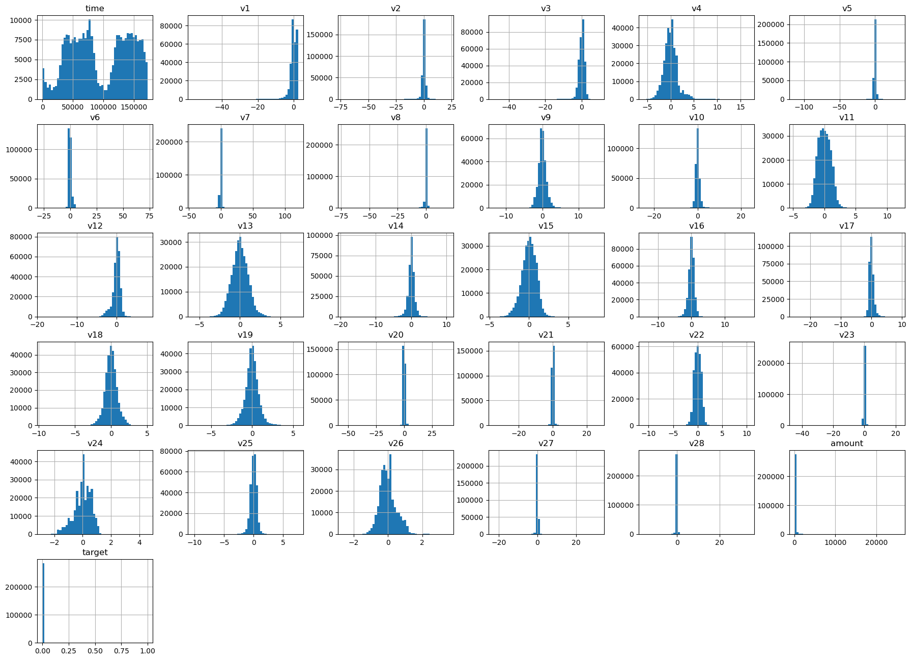
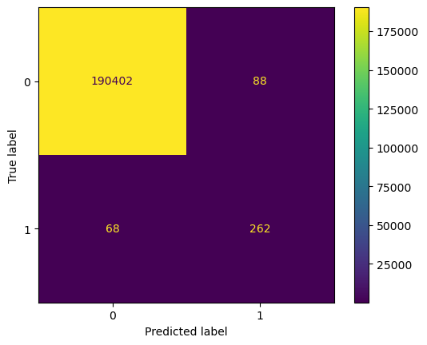
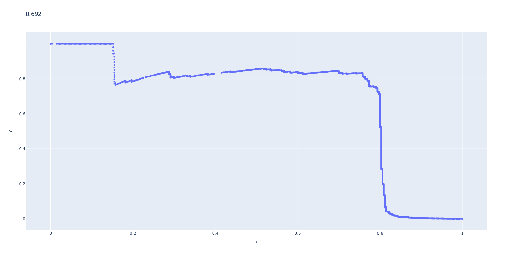
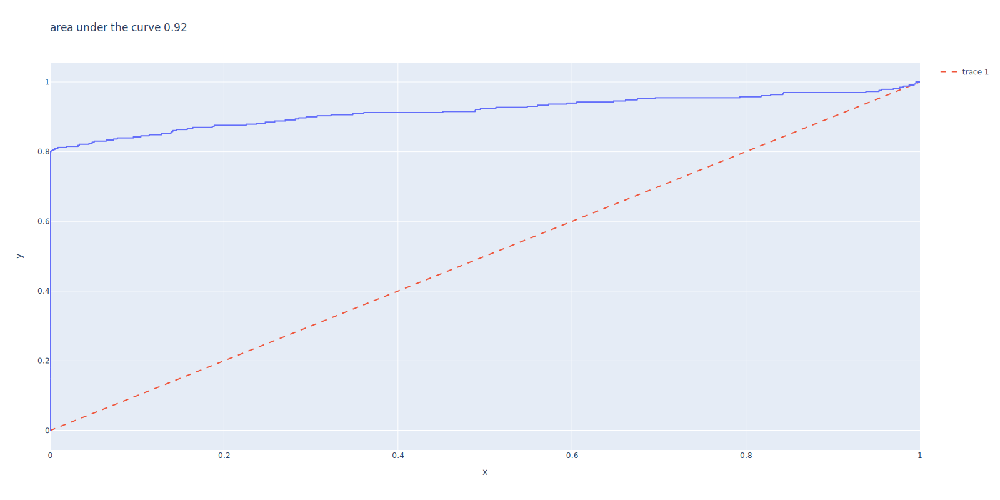
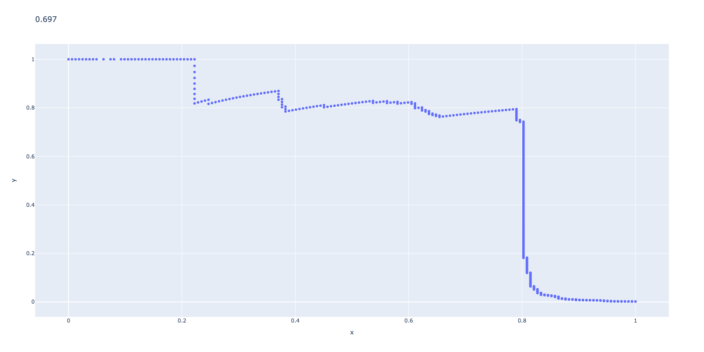
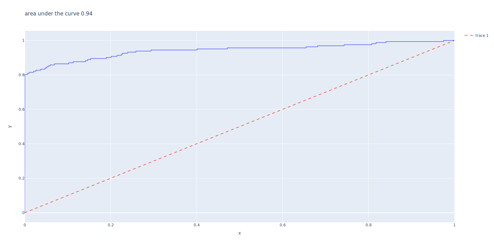

```python
import numpy as np
import pandas as pd
import matplotlib.pyplot as plt
import plotly.express as px
pd.options.plotting.backend= "plotly"
pd.set_option('display.max_columns', 150, 'display.max_rows', 100, 'display.max_colwidth', 15)
%matplotlib inline 
```


```python
#!jupyter nbconvert --to markdown --output mymarkdownfile.md Anamoly_detection_credit_card.ipynb
#!pandoc mymarkdownfile.md -s --mathml  -o mathMathML.html
#!pandoc  mymarkdownfile.md  -t revealjs -V theme=white -V slideNumber=true -o index.html
#!pandoc  Anamoly_detection_credit_card.ipynb  -t revealjs -V theme=white -V slideNumber=true -o index1.html
```


```python
import subprocess

# Replace "my_presentation.md" with the name of your Markdown file
md_file = "mymarkdownfile.md"

# Convert Markdown to HTML
html_file = md_file.replace(".md", ".html")
subprocess.run(["pandoc", "-f", "markdown", "-t", "html", "-s", "-o", html_file, md_file])

# Convert HTML to slides
slides_file = md_file.replace(".md", ".slides.html")
subprocess.run(["pandoc", "-t", "revealjs", "-s", "-o", slides_file, html_file])
#Note that you still need to have Pandoc and Python installed on your system and replace "my_presentation.md" with the name of your actual Markdown file.
```


    CompletedProcess(args=['pandoc', '-t', 'revealjs', '-s', '-o', 'mymarkdownfile.slides.html', 'mymarkdownfile.html'], returncode=0)


```python

#!pandoc -t dzslides mymarkdown.md -o pandoc/dzslides-pandoc.html --embed-resources --standalone
#!pandoc -t slidy habits.md -o pandoc/slidy-pandoc.html --self-contained
#!pandoc -t revealjs habits.md -o pandoc/revealjs-pandoc.html -sV revealjs-url=https://revealjs.com
#!jupyter nbconvert --to slides --output mymarkdownfile.html Anamoly_detection_credit_card.ipynb
#!jupyter nbconvert --to slides --post serve Anamoly_detection_credit_card.ipynb
#!jupyter nbconvert --to slides --execute Anamoly_detection_credit_card.ipynb
#!pip install autoviz
```

* [Introduction](#1)

* [Methodology](#2)

* [Conclusion](#5)

<a id='1'></a> 
# Introduction 

* In the real world, fraud often goes undiscovered, and only the fraud that is caught provides any labels for the datasets. 

* Moreover, fraud patterns change over time, so supervised systems that are built using fraud labels become stale, capturing historical patterns of fraud but failing to adapt to newly emerging patterns.

* For these reasons (the lack of sufficient labels and the need to adapt to newly emerging patterns of fraud as quickly as possible), unsupervised learning fraud detection systems are in vogue.

* In this notebook, we will build such a solution using PCA 

## What is PCA

PCA (Principal Component Analysis) is a technique to find a low-dimensional representation of a dataset that captures as much variation as possible. It seeks a small number of dimensions that are interesting and informative, where each dimension is a linear combination of the original features. The first principal component is a normalized linear combination of the features that has the largest variance. It can be found through an optimization problem, and the resulting loadings and scores make up the principal component loading vector. PCA is useful when the original dataset has a large number of features, making it difficult to visualize and analyze.


```python
# load dataset
df = pd.read_csv('/Users/waleedidrees/Dropbox/Python_Projects/books/handson-unsupervised-learning-master/datasets/credit_card_data/credit_card.csv').rename(columns= {"Class":"target"})
df.head()
```


<div>
<style scoped>
    .dataframe tbody tr th:only-of-type {
        vertical-align: middle;
    }

    .dataframe tbody tr th {
        vertical-align: top;
    }

    .dataframe thead th {
        text-align: right;
    }
</style>
<table border="1" class="dataframe">
  <thead>
    <tr style="text-align: right;">
      <th></th>
      <th>Time</th>
      <th>V1</th>
      <th>V2</th>
      <th>V3</th>
      <th>V4</th>
      <th>V5</th>
      <th>V6</th>
      <th>V7</th>
      <th>V8</th>
      <th>V9</th>
      <th>V10</th>
      <th>V11</th>
      <th>V12</th>
      <th>V13</th>
      <th>V14</th>
      <th>V15</th>
      <th>V16</th>
      <th>V17</th>
      <th>V18</th>
      <th>V19</th>
      <th>V20</th>
      <th>V21</th>
      <th>V22</th>
      <th>V23</th>
      <th>V24</th>
      <th>V25</th>
      <th>V26</th>
      <th>V27</th>
      <th>V28</th>
      <th>Amount</th>
      <th>target</th>
    </tr>
  </thead>
  <tbody>
    <tr>
      <th>0</th>
      <td>0.0</td>
      <td>-1.359807</td>
      <td>-0.072781</td>
      <td>2.536347</td>
      <td>1.378155</td>
      <td>-0.338321</td>
      <td>0.462388</td>
      <td>0.239599</td>
      <td>0.098698</td>
      <td>0.363787</td>
      <td>0.090794</td>
      <td>-0.551600</td>
      <td>-0.617801</td>
      <td>-0.991390</td>
      <td>-0.311169</td>
      <td>1.468177</td>
      <td>-0.470401</td>
      <td>0.207971</td>
      <td>0.025791</td>
      <td>0.403993</td>
      <td>0.251412</td>
      <td>-0.018307</td>
      <td>0.277838</td>
      <td>-0.110474</td>
      <td>0.066928</td>
      <td>0.128539</td>
      <td>-0.189115</td>
      <td>0.133558</td>
      <td>-0.021053</td>
      <td>149.62</td>
      <td>0</td>
    </tr>
    <tr>
      <th>1</th>
      <td>0.0</td>
      <td>1.191857</td>
      <td>0.266151</td>
      <td>0.166480</td>
      <td>0.448154</td>
      <td>0.060018</td>
      <td>-0.082361</td>
      <td>-0.078803</td>
      <td>0.085102</td>
      <td>-0.255425</td>
      <td>-0.166974</td>
      <td>1.612727</td>
      <td>1.065235</td>
      <td>0.489095</td>
      <td>-0.143772</td>
      <td>0.635558</td>
      <td>0.463917</td>
      <td>-0.114805</td>
      <td>-0.183361</td>
      <td>-0.145783</td>
      <td>-0.069083</td>
      <td>-0.225775</td>
      <td>-0.638672</td>
      <td>0.101288</td>
      <td>-0.339846</td>
      <td>0.167170</td>
      <td>0.125895</td>
      <td>-0.008983</td>
      <td>0.014724</td>
      <td>2.69</td>
      <td>0</td>
    </tr>
    <tr>
      <th>2</th>
      <td>1.0</td>
      <td>-1.358354</td>
      <td>-1.340163</td>
      <td>1.773209</td>
      <td>0.379780</td>
      <td>-0.503198</td>
      <td>1.800499</td>
      <td>0.791461</td>
      <td>0.247676</td>
      <td>-1.514654</td>
      <td>0.207643</td>
      <td>0.624501</td>
      <td>0.066084</td>
      <td>0.717293</td>
      <td>-0.165946</td>
      <td>2.345865</td>
      <td>-2.890083</td>
      <td>1.109969</td>
      <td>-0.121359</td>
      <td>-2.261857</td>
      <td>0.524980</td>
      <td>0.247998</td>
      <td>0.771679</td>
      <td>0.909412</td>
      <td>-0.689281</td>
      <td>-0.327642</td>
      <td>-0.139097</td>
      <td>-0.055353</td>
      <td>-0.059752</td>
      <td>378.66</td>
      <td>0</td>
    </tr>
    <tr>
      <th>3</th>
      <td>1.0</td>
      <td>-0.966272</td>
      <td>-0.185226</td>
      <td>1.792993</td>
      <td>-0.863291</td>
      <td>-0.010309</td>
      <td>1.247203</td>
      <td>0.237609</td>
      <td>0.377436</td>
      <td>-1.387024</td>
      <td>-0.054952</td>
      <td>-0.226487</td>
      <td>0.178228</td>
      <td>0.507757</td>
      <td>-0.287924</td>
      <td>-0.631418</td>
      <td>-1.059647</td>
      <td>-0.684093</td>
      <td>1.965775</td>
      <td>-1.232622</td>
      <td>-0.208038</td>
      <td>-0.108300</td>
      <td>0.005274</td>
      <td>-0.190321</td>
      <td>-1.175575</td>
      <td>0.647376</td>
      <td>-0.221929</td>
      <td>0.062723</td>
      <td>0.061458</td>
      <td>123.50</td>
      <td>0</td>
    </tr>
    <tr>
      <th>4</th>
      <td>2.0</td>
      <td>-1.158233</td>
      <td>0.877737</td>
      <td>1.548718</td>
      <td>0.403034</td>
      <td>-0.407193</td>
      <td>0.095921</td>
      <td>0.592941</td>
      <td>-0.270533</td>
      <td>0.817739</td>
      <td>0.753074</td>
      <td>-0.822843</td>
      <td>0.538196</td>
      <td>1.345852</td>
      <td>-1.119670</td>
      <td>0.175121</td>
      <td>-0.451449</td>
      <td>-0.237033</td>
      <td>-0.038195</td>
      <td>0.803487</td>
      <td>0.408542</td>
      <td>-0.009431</td>
      <td>0.798278</td>
      <td>-0.137458</td>
      <td>0.141267</td>
      <td>-0.206010</td>
      <td>0.502292</td>
      <td>0.219422</td>
      <td>0.215153</td>
      <td>69.99</td>
      <td>0</td>
    </tr>
  </tbody>
</table>
</div>


```python
df.columns= df.columns.str.lower()
df.head()
```


<div>
<style scoped>
    .dataframe tbody tr th:only-of-type {
        vertical-align: middle;
    }

    .dataframe tbody tr th {
        vertical-align: top;
    }

    .dataframe thead th {
        text-align: right;
    }
</style>
<table border="1" class="dataframe">
  <thead>
    <tr style="text-align: right;">
      <th></th>
      <th>time</th>
      <th>v1</th>
      <th>v2</th>
      <th>v3</th>
      <th>v4</th>
      <th>v5</th>
      <th>v6</th>
      <th>v7</th>
      <th>v8</th>
      <th>v9</th>
      <th>v10</th>
      <th>v11</th>
      <th>v12</th>
      <th>v13</th>
      <th>v14</th>
      <th>v15</th>
      <th>v16</th>
      <th>v17</th>
      <th>v18</th>
      <th>v19</th>
      <th>v20</th>
      <th>v21</th>
      <th>v22</th>
      <th>v23</th>
      <th>v24</th>
      <th>v25</th>
      <th>v26</th>
      <th>v27</th>
      <th>v28</th>
      <th>amount</th>
      <th>target</th>
    </tr>
  </thead>
  <tbody>
    <tr>
      <th>0</th>
      <td>0.0</td>
      <td>-1.359807</td>
      <td>-0.072781</td>
      <td>2.536347</td>
      <td>1.378155</td>
      <td>-0.338321</td>
      <td>0.462388</td>
      <td>0.239599</td>
      <td>0.098698</td>
      <td>0.363787</td>
      <td>0.090794</td>
      <td>-0.551600</td>
      <td>-0.617801</td>
      <td>-0.991390</td>
      <td>-0.311169</td>
      <td>1.468177</td>
      <td>-0.470401</td>
      <td>0.207971</td>
      <td>0.025791</td>
      <td>0.403993</td>
      <td>0.251412</td>
      <td>-0.018307</td>
      <td>0.277838</td>
      <td>-0.110474</td>
      <td>0.066928</td>
      <td>0.128539</td>
      <td>-0.189115</td>
      <td>0.133558</td>
      <td>-0.021053</td>
      <td>149.62</td>
      <td>0</td>
    </tr>
    <tr>
      <th>1</th>
      <td>0.0</td>
      <td>1.191857</td>
      <td>0.266151</td>
      <td>0.166480</td>
      <td>0.448154</td>
      <td>0.060018</td>
      <td>-0.082361</td>
      <td>-0.078803</td>
      <td>0.085102</td>
      <td>-0.255425</td>
      <td>-0.166974</td>
      <td>1.612727</td>
      <td>1.065235</td>
      <td>0.489095</td>
      <td>-0.143772</td>
      <td>0.635558</td>
      <td>0.463917</td>
      <td>-0.114805</td>
      <td>-0.183361</td>
      <td>-0.145783</td>
      <td>-0.069083</td>
      <td>-0.225775</td>
      <td>-0.638672</td>
      <td>0.101288</td>
      <td>-0.339846</td>
      <td>0.167170</td>
      <td>0.125895</td>
      <td>-0.008983</td>
      <td>0.014724</td>
      <td>2.69</td>
      <td>0</td>
    </tr>
    <tr>
      <th>2</th>
      <td>1.0</td>
      <td>-1.358354</td>
      <td>-1.340163</td>
      <td>1.773209</td>
      <td>0.379780</td>
      <td>-0.503198</td>
      <td>1.800499</td>
      <td>0.791461</td>
      <td>0.247676</td>
      <td>-1.514654</td>
      <td>0.207643</td>
      <td>0.624501</td>
      <td>0.066084</td>
      <td>0.717293</td>
      <td>-0.165946</td>
      <td>2.345865</td>
      <td>-2.890083</td>
      <td>1.109969</td>
      <td>-0.121359</td>
      <td>-2.261857</td>
      <td>0.524980</td>
      <td>0.247998</td>
      <td>0.771679</td>
      <td>0.909412</td>
      <td>-0.689281</td>
      <td>-0.327642</td>
      <td>-0.139097</td>
      <td>-0.055353</td>
      <td>-0.059752</td>
      <td>378.66</td>
      <td>0</td>
    </tr>
    <tr>
      <th>3</th>
      <td>1.0</td>
      <td>-0.966272</td>
      <td>-0.185226</td>
      <td>1.792993</td>
      <td>-0.863291</td>
      <td>-0.010309</td>
      <td>1.247203</td>
      <td>0.237609</td>
      <td>0.377436</td>
      <td>-1.387024</td>
      <td>-0.054952</td>
      <td>-0.226487</td>
      <td>0.178228</td>
      <td>0.507757</td>
      <td>-0.287924</td>
      <td>-0.631418</td>
      <td>-1.059647</td>
      <td>-0.684093</td>
      <td>1.965775</td>
      <td>-1.232622</td>
      <td>-0.208038</td>
      <td>-0.108300</td>
      <td>0.005274</td>
      <td>-0.190321</td>
      <td>-1.175575</td>
      <td>0.647376</td>
      <td>-0.221929</td>
      <td>0.062723</td>
      <td>0.061458</td>
      <td>123.50</td>
      <td>0</td>
    </tr>
    <tr>
      <th>4</th>
      <td>2.0</td>
      <td>-1.158233</td>
      <td>0.877737</td>
      <td>1.548718</td>
      <td>0.403034</td>
      <td>-0.407193</td>
      <td>0.095921</td>
      <td>0.592941</td>
      <td>-0.270533</td>
      <td>0.817739</td>
      <td>0.753074</td>
      <td>-0.822843</td>
      <td>0.538196</td>
      <td>1.345852</td>
      <td>-1.119670</td>
      <td>0.175121</td>
      <td>-0.451449</td>
      <td>-0.237033</td>
      <td>-0.038195</td>
      <td>0.803487</td>
      <td>0.408542</td>
      <td>-0.009431</td>
      <td>0.798278</td>
      <td>-0.137458</td>
      <td>0.141267</td>
      <td>-0.206010</td>
      <td>0.502292</td>
      <td>0.219422</td>
      <td>0.215153</td>
      <td>69.99</td>
      <td>0</td>
    </tr>
  </tbody>
</table>
</div>


# Disable the warnings


```python
import warnings
warnings.filterwarnings('ignore')
```


```python
df.describe().T
```


<div>
<style scoped>
    .dataframe tbody tr th:only-of-type {
        vertical-align: middle;
    }

    .dataframe tbody tr th {
        vertical-align: top;
    }

    .dataframe thead th {
        text-align: right;
    }
</style>
<table border="1" class="dataframe">
  <thead>
    <tr style="text-align: right;">
      <th></th>
      <th>count</th>
      <th>mean</th>
      <th>std</th>
      <th>min</th>
      <th>25%</th>
      <th>50%</th>
      <th>75%</th>
      <th>max</th>
    </tr>
  </thead>
  <tbody>
    <tr>
      <th>time</th>
      <td>284807.0</td>
      <td>9.481386e+04</td>
      <td>47488.145955</td>
      <td>0.000000</td>
      <td>54201.500000</td>
      <td>84692.000000</td>
      <td>139320.500000</td>
      <td>172792.000000</td>
    </tr>
    <tr>
      <th>v1</th>
      <td>284807.0</td>
      <td>1.168375e-15</td>
      <td>1.958696</td>
      <td>-56.407510</td>
      <td>-0.920373</td>
      <td>0.018109</td>
      <td>1.315642</td>
      <td>2.454930</td>
    </tr>
    <tr>
      <th>v2</th>
      <td>284807.0</td>
      <td>3.416908e-16</td>
      <td>1.651309</td>
      <td>-72.715728</td>
      <td>-0.598550</td>
      <td>0.065486</td>
      <td>0.803724</td>
      <td>22.057729</td>
    </tr>
    <tr>
      <th>v3</th>
      <td>284807.0</td>
      <td>-1.379537e-15</td>
      <td>1.516255</td>
      <td>-48.325589</td>
      <td>-0.890365</td>
      <td>0.179846</td>
      <td>1.027196</td>
      <td>9.382558</td>
    </tr>
    <tr>
      <th>v4</th>
      <td>284807.0</td>
      <td>2.074095e-15</td>
      <td>1.415869</td>
      <td>-5.683171</td>
      <td>-0.848640</td>
      <td>-0.019847</td>
      <td>0.743341</td>
      <td>16.875344</td>
    </tr>
    <tr>
      <th>v5</th>
      <td>284807.0</td>
      <td>9.604066e-16</td>
      <td>1.380247</td>
      <td>-113.743307</td>
      <td>-0.691597</td>
      <td>-0.054336</td>
      <td>0.611926</td>
      <td>34.801666</td>
    </tr>
    <tr>
      <th>v6</th>
      <td>284807.0</td>
      <td>1.487313e-15</td>
      <td>1.332271</td>
      <td>-26.160506</td>
      <td>-0.768296</td>
      <td>-0.274187</td>
      <td>0.398565</td>
      <td>73.301626</td>
    </tr>
    <tr>
      <th>v7</th>
      <td>284807.0</td>
      <td>-5.556467e-16</td>
      <td>1.237094</td>
      <td>-43.557242</td>
      <td>-0.554076</td>
      <td>0.040103</td>
      <td>0.570436</td>
      <td>120.589494</td>
    </tr>
    <tr>
      <th>v8</th>
      <td>284807.0</td>
      <td>1.213481e-16</td>
      <td>1.194353</td>
      <td>-73.216718</td>
      <td>-0.208630</td>
      <td>0.022358</td>
      <td>0.327346</td>
      <td>20.007208</td>
    </tr>
    <tr>
      <th>v9</th>
      <td>284807.0</td>
      <td>-2.406331e-15</td>
      <td>1.098632</td>
      <td>-13.434066</td>
      <td>-0.643098</td>
      <td>-0.051429</td>
      <td>0.597139</td>
      <td>15.594995</td>
    </tr>
    <tr>
      <th>v10</th>
      <td>284807.0</td>
      <td>2.239053e-15</td>
      <td>1.088850</td>
      <td>-24.588262</td>
      <td>-0.535426</td>
      <td>-0.092917</td>
      <td>0.453923</td>
      <td>23.745136</td>
    </tr>
    <tr>
      <th>v11</th>
      <td>284807.0</td>
      <td>1.673327e-15</td>
      <td>1.020713</td>
      <td>-4.797473</td>
      <td>-0.762494</td>
      <td>-0.032757</td>
      <td>0.739593</td>
      <td>12.018913</td>
    </tr>
    <tr>
      <th>v12</th>
      <td>284807.0</td>
      <td>-1.247012e-15</td>
      <td>0.999201</td>
      <td>-18.683715</td>
      <td>-0.405571</td>
      <td>0.140033</td>
      <td>0.618238</td>
      <td>7.848392</td>
    </tr>
    <tr>
      <th>v13</th>
      <td>284807.0</td>
      <td>8.190001e-16</td>
      <td>0.995274</td>
      <td>-5.791881</td>
      <td>-0.648539</td>
      <td>-0.013568</td>
      <td>0.662505</td>
      <td>7.126883</td>
    </tr>
    <tr>
      <th>v14</th>
      <td>284807.0</td>
      <td>1.207294e-15</td>
      <td>0.958596</td>
      <td>-19.214325</td>
      <td>-0.425574</td>
      <td>0.050601</td>
      <td>0.493150</td>
      <td>10.526766</td>
    </tr>
    <tr>
      <th>v15</th>
      <td>284807.0</td>
      <td>4.887456e-15</td>
      <td>0.915316</td>
      <td>-4.498945</td>
      <td>-0.582884</td>
      <td>0.048072</td>
      <td>0.648821</td>
      <td>8.877742</td>
    </tr>
    <tr>
      <th>v16</th>
      <td>284807.0</td>
      <td>1.437716e-15</td>
      <td>0.876253</td>
      <td>-14.129855</td>
      <td>-0.468037</td>
      <td>0.066413</td>
      <td>0.523296</td>
      <td>17.315112</td>
    </tr>
    <tr>
      <th>v17</th>
      <td>284807.0</td>
      <td>-3.772171e-16</td>
      <td>0.849337</td>
      <td>-25.162799</td>
      <td>-0.483748</td>
      <td>-0.065676</td>
      <td>0.399675</td>
      <td>9.253526</td>
    </tr>
    <tr>
      <th>v18</th>
      <td>284807.0</td>
      <td>9.564149e-16</td>
      <td>0.838176</td>
      <td>-9.498746</td>
      <td>-0.498850</td>
      <td>-0.003636</td>
      <td>0.500807</td>
      <td>5.041069</td>
    </tr>
    <tr>
      <th>v19</th>
      <td>284807.0</td>
      <td>1.039917e-15</td>
      <td>0.814041</td>
      <td>-7.213527</td>
      <td>-0.456299</td>
      <td>0.003735</td>
      <td>0.458949</td>
      <td>5.591971</td>
    </tr>
    <tr>
      <th>v20</th>
      <td>284807.0</td>
      <td>6.406204e-16</td>
      <td>0.770925</td>
      <td>-54.497720</td>
      <td>-0.211721</td>
      <td>-0.062481</td>
      <td>0.133041</td>
      <td>39.420904</td>
    </tr>
    <tr>
      <th>v21</th>
      <td>284807.0</td>
      <td>1.654067e-16</td>
      <td>0.734524</td>
      <td>-34.830382</td>
      <td>-0.228395</td>
      <td>-0.029450</td>
      <td>0.186377</td>
      <td>27.202839</td>
    </tr>
    <tr>
      <th>v22</th>
      <td>284807.0</td>
      <td>-3.568593e-16</td>
      <td>0.725702</td>
      <td>-10.933144</td>
      <td>-0.542350</td>
      <td>0.006782</td>
      <td>0.528554</td>
      <td>10.503090</td>
    </tr>
    <tr>
      <th>v23</th>
      <td>284807.0</td>
      <td>2.578648e-16</td>
      <td>0.624460</td>
      <td>-44.807735</td>
      <td>-0.161846</td>
      <td>-0.011193</td>
      <td>0.147642</td>
      <td>22.528412</td>
    </tr>
    <tr>
      <th>v24</th>
      <td>284807.0</td>
      <td>4.473266e-15</td>
      <td>0.605647</td>
      <td>-2.836627</td>
      <td>-0.354586</td>
      <td>0.040976</td>
      <td>0.439527</td>
      <td>4.584549</td>
    </tr>
    <tr>
      <th>v25</th>
      <td>284807.0</td>
      <td>5.340915e-16</td>
      <td>0.521278</td>
      <td>-10.295397</td>
      <td>-0.317145</td>
      <td>0.016594</td>
      <td>0.350716</td>
      <td>7.519589</td>
    </tr>
    <tr>
      <th>v26</th>
      <td>284807.0</td>
      <td>1.683437e-15</td>
      <td>0.482227</td>
      <td>-2.604551</td>
      <td>-0.326984</td>
      <td>-0.052139</td>
      <td>0.240952</td>
      <td>3.517346</td>
    </tr>
    <tr>
      <th>v27</th>
      <td>284807.0</td>
      <td>-3.660091e-16</td>
      <td>0.403632</td>
      <td>-22.565679</td>
      <td>-0.070840</td>
      <td>0.001342</td>
      <td>0.091045</td>
      <td>31.612198</td>
    </tr>
    <tr>
      <th>v28</th>
      <td>284807.0</td>
      <td>-1.227390e-16</td>
      <td>0.330083</td>
      <td>-15.430084</td>
      <td>-0.052960</td>
      <td>0.011244</td>
      <td>0.078280</td>
      <td>33.847808</td>
    </tr>
    <tr>
      <th>amount</th>
      <td>284807.0</td>
      <td>8.834962e+01</td>
      <td>250.120109</td>
      <td>0.000000</td>
      <td>5.600000</td>
      <td>22.000000</td>
      <td>77.165000</td>
      <td>25691.160000</td>
    </tr>
    <tr>
      <th>target</th>
      <td>284807.0</td>
      <td>1.727486e-03</td>
      <td>0.041527</td>
      <td>0.000000</td>
      <td>0.000000</td>
      <td>0.000000</td>
      <td>0.000000</td>
      <td>1.000000</td>
    </tr>
  </tbody>
</table>
</div>


## we see that fraudulent transactions are very rare and this makes the data very imbalanced


```python
df["target"].value_counts().reset_index()
```


<div>
<style scoped>
    .dataframe tbody tr th:only-of-type {
        vertical-align: middle;
    }

    .dataframe tbody tr th {
        vertical-align: top;
    }

    .dataframe thead th {
        text-align: right;
    }
</style>
<table border="1" class="dataframe">
  <thead>
    <tr style="text-align: right;">
      <th></th>
      <th>index</th>
      <th>target</th>
    </tr>
  </thead>
  <tbody>
    <tr>
      <th>0</th>
      <td>0</td>
      <td>284315</td>
    </tr>
    <tr>
      <th>1</th>
      <td>1</td>
      <td>492</td>
    </tr>
  </tbody>
</table>
</div>


we have 284,807 credit card transactions in total, of which 492 are fraudulent, with a positive (fraud) label of one. The rest are normal transactions, with a negative (not fraud) label of zero.
We have 30 features to use for anomaly detection—time, amount, and 28 principal components. And, we will split the dataset into a training set (with 190,820 transactions and 330 cases of fraud) and a test set
(with the remaining 93,987 transactions and 162 cases of fraud)


```python
(
df["target"]
.value_counts()
.reset_index()
.plot.bar(x="index", y= "target", color="index", height= 800, width= 800)
 )
```


```python
pd.options.plotting.backend = "matplotlib"

df.hist(figsize= (22,16), bins=50)

pd.options.plotting.backend = "plotly"
```


    

    


<a id='2'></a> 

## Methodology

Since this an unsupervised learning problem and we will not be using the labels so we need find a way to measure the performance of the anamoly model.  Dimensionality reduction algorithms reduce the dimensionality of data while attempting to minimize the reconstruction error. However, these dimensionality reduction algorithms cannot capture all the information of the original features as they move to a lower dimensional space; therefore, there will be some error as these algorithms reconstruct the reduced feature set back to the original number of dimensions.
we will use these errors and make a function to compare them to the original dataframe and measure the score. 
we make our performance measure as follows:

* We take the difference between the original vs the pca dataframe which we created from pcs components using inverse transformation
* then we transform the difference using min max scaller from 0 to 1 scale
* we can consider this score as probability score and use this against the labels to calculate, precision, recall and threshhold using sklearn precision recall curve metric. 
* We will take x number of highest scores as our anomolies
* we can all also calculate average precision score using the average precision score metric.

# Define evaluation functions


```python
# Calculate reconstruction error
def anomalyScores(originalDF, pca_df):
    loss = ((originalDF.values- pca_df.values)**2).sum(axis=1)    
    loss = pd.Series(data=loss,index=originalDF.index)
    loss = (loss-np.min(loss))/(np.max(loss)-np.min(loss))
    return loss
```

# Train-test splits
We will remove the target variable and we will not be using it for training but we will use it to evaluate the anamolies by attaching it to anamoly scores


```python
from sklearn.model_selection import train_test_split
X_train, X_test, y_train, y_test =  train_test_split(df.drop(columns=["target","time"]).copy(), df["target"], test_size = 0.33,stratify=df["target"],  random_state = 2018 )
X_train.shape, y_train.shape, X_test.shape, y_test.shape
```


    ((190820, 29), (190820,), (93987, 29), (93987,))


The train data has 330 Fraudulent transaction and 190490 normal transactions


```python
y_train.value_counts()
```


    0    190490
    1       330
    Name: target, dtype: int64


# Lets create Preprocessing Pipiline
* all our variables are numeric we will standardise data and then as for PCA we must standardise observations.


```python
from sklearn.preprocessing import StandardScaler
from sklearn.pipeline import Pipeline
from sklearn.compose import ColumnTransformer
from sklearn.decomposition import PCA
from sklearn.impute import KNNImputer
```


```python
num_pipe= Pipeline ( steps=[
    ("std", StandardScaler()),
    ("impute", KNNImputer()), 
    ])
```


```python
all_cols= X_train.columns
prep= ColumnTransformer([
    ("n", num_pipe, all_cols)
    ]).set_output(transform= "pandas")
prep.fit_transform(X_train).head()
```


<div>
<style scoped>
    .dataframe tbody tr th:only-of-type {
        vertical-align: middle;
    }

    .dataframe tbody tr th {
        vertical-align: top;
    }

    .dataframe thead th {
        text-align: right;
    }
</style>
<table border="1" class="dataframe">
  <thead>
    <tr style="text-align: right;">
      <th></th>
      <th>n__v1</th>
      <th>n__v2</th>
      <th>n__v3</th>
      <th>n__v4</th>
      <th>n__v5</th>
      <th>n__v6</th>
      <th>n__v7</th>
      <th>n__v8</th>
      <th>n__v9</th>
      <th>n__v10</th>
      <th>n__v11</th>
      <th>n__v12</th>
      <th>n__v13</th>
      <th>n__v14</th>
      <th>n__v15</th>
      <th>n__v16</th>
      <th>n__v17</th>
      <th>n__v18</th>
      <th>n__v19</th>
      <th>n__v20</th>
      <th>n__v21</th>
      <th>n__v22</th>
      <th>n__v23</th>
      <th>n__v24</th>
      <th>n__v25</th>
      <th>n__v26</th>
      <th>n__v27</th>
      <th>n__v28</th>
      <th>n__amount</th>
    </tr>
  </thead>
  <tbody>
    <tr>
      <th>142087</th>
      <td>-1.008613</td>
      <td>1.168013</td>
      <td>0.203077</td>
      <td>-0.252933</td>
      <td>-0.387030</td>
      <td>-0.051340</td>
      <td>-0.191393</td>
      <td>0.917626</td>
      <td>-0.220348</td>
      <td>0.379391</td>
      <td>0.891953</td>
      <td>0.652099</td>
      <td>-0.481673</td>
      <td>0.888920</td>
      <td>0.511094</td>
      <td>0.459652</td>
      <td>-0.178769</td>
      <td>-0.131099</td>
      <td>-0.030699</td>
      <td>0.240351</td>
      <td>-0.230649</td>
      <td>-0.781406</td>
      <td>0.154163</td>
      <td>-0.584578</td>
      <td>-0.161870</td>
      <td>0.232116</td>
      <td>0.525621</td>
      <td>0.459397</td>
      <td>-0.301324</td>
    </tr>
    <tr>
      <th>165168</th>
      <td>0.071848</td>
      <td>0.664025</td>
      <td>-0.240845</td>
      <td>-0.381091</td>
      <td>0.694608</td>
      <td>-0.633906</td>
      <td>0.833474</td>
      <td>-0.132701</td>
      <td>-0.166967</td>
      <td>-0.793682</td>
      <td>-0.490992</td>
      <td>0.366808</td>
      <td>0.879055</td>
      <td>-1.245368</td>
      <td>-0.369767</td>
      <td>0.316392</td>
      <td>0.393419</td>
      <td>-0.407275</td>
      <td>-0.310150</td>
      <td>0.099453</td>
      <td>-0.438520</td>
      <td>-1.037593</td>
      <td>0.145573</td>
      <td>1.078771</td>
      <td>-0.761303</td>
      <td>0.221753</td>
      <td>0.564899</td>
      <td>0.254973</td>
      <td>-0.342346</td>
    </tr>
    <tr>
      <th>235908</th>
      <td>0.099163</td>
      <td>-0.387383</td>
      <td>-0.945009</td>
      <td>-1.493663</td>
      <td>-0.092322</td>
      <td>-0.878326</td>
      <td>1.252531</td>
      <td>-0.564372</td>
      <td>-2.760963</td>
      <td>0.979945</td>
      <td>-0.734286</td>
      <td>-0.940293</td>
      <td>0.749094</td>
      <td>0.176712</td>
      <td>-1.084605</td>
      <td>-2.049873</td>
      <td>1.119388</td>
      <td>-0.424709</td>
      <td>0.039325</td>
      <td>0.136822</td>
      <td>0.597949</td>
      <td>2.047828</td>
      <td>0.533608</td>
      <td>1.885871</td>
      <td>-0.949325</td>
      <td>0.195840</td>
      <td>0.394576</td>
      <td>0.789716</td>
      <td>0.507010</td>
    </tr>
    <tr>
      <th>148255</th>
      <td>0.015486</td>
      <td>0.519611</td>
      <td>0.193472</td>
      <td>-0.418969</td>
      <td>0.316777</td>
      <td>-0.774851</td>
      <td>0.816615</td>
      <td>-0.154107</td>
      <td>-0.060485</td>
      <td>-0.393037</td>
      <td>-0.838072</td>
      <td>0.229399</td>
      <td>0.138905</td>
      <td>0.095691</td>
      <td>-0.404080</td>
      <td>-0.180757</td>
      <td>-0.428453</td>
      <td>-1.022053</td>
      <td>-0.193808</td>
      <td>-0.038190</td>
      <td>-0.336778</td>
      <td>-0.738483</td>
      <td>0.127711</td>
      <td>-0.026519</td>
      <td>-0.955999</td>
      <td>0.297594</td>
      <td>0.620507</td>
      <td>0.285961</td>
      <td>-0.333753</td>
    </tr>
    <tr>
      <th>145672</th>
      <td>0.009053</td>
      <td>0.524138</td>
      <td>0.175338</td>
      <td>-0.335413</td>
      <td>0.761346</td>
      <td>0.501074</td>
      <td>0.266188</td>
      <td>0.187765</td>
      <td>-0.186259</td>
      <td>-0.837330</td>
      <td>0.231244</td>
      <td>0.693028</td>
      <td>1.261985</td>
      <td>-1.542311</td>
      <td>-0.324732</td>
      <td>1.234117</td>
      <td>-0.316896</td>
      <td>1.377317</td>
      <td>0.854111</td>
      <td>0.109213</td>
      <td>-0.199423</td>
      <td>-0.454902</td>
      <td>0.047231</td>
      <td>-0.725277</td>
      <td>-2.181428</td>
      <td>-0.147735</td>
      <td>0.586351</td>
      <td>0.739459</td>
      <td>-0.337806</td>
    </tr>
  </tbody>
</table>
</div>


## PCA custom class

* We create a Custom Transformer which will give us labels on the basis of top 350 highest anomoly score using our performace score function
* this will be added in predict method.


```python
from sklearn.base import MetaEstimatorMixin, clone
from sklearn.base import BaseEstimator, TransformerMixin

class pca_anom(BaseEstimator, TransformerMixin):
    def __init__(self,estimator, top_x):           
        self.estimator = estimator
        self.top_x =top_x
    
    def fit(self, X,y=None):       
       estimator_= clone(self.estimator)
       self.model= estimator_.fit(X)
       return self   
        
    def transform(self, X, y=None):                
        self.columns = self.model.transform(X).shape[1]        
        return self.model.transform(X)
    
    def get_feature_names_out(self, names=None):        
        return [f'pca{x}'for x in range(self.columns) ]    
    
    def predict(self, X ):                   
        df_pca_inv= pd.DataFrame(self.model.inverse_transform(self.model.transform(X)))
        df_pca_inv.columns= X.columns       
        results= pd.DataFrame()        
        results["prob"]= anomalyScores(X,df_pca_inv)
        anamloies= results.sort_values("prob" , ascending= False).head(self.top_x)        
        results= results.assign(class_=  np.where(results.index.isin(anamloies.index), 1,0 ))
        return results[["class_"]]
    
    def predict_proba(self, X ):             
        df_pca_inv= pd.DataFrame(self.model.inverse_transform(self.model.transform(X)))
        df_pca_inv.columns= X.columns       
        results= pd.DataFrame()        
        results["prob"]= anomalyScores(X,df_pca_inv)
        return results
```

# Lets define Evaluation Function to measure the recall, precision and roc_auc score


```python
# Evaluation Functions
from sklearn.metrics import accuracy_score, recall_score ,average_precision_score, precision_recall_curve, precision_score, roc_auc_score,roc_curve, auc 
def eval_scores(actuals, pred):
    res= pd.DataFrame({ 
    "accuracy": [accuracy_score(actuals, pred)], 
    "recall": [recall_score(actuals, pred)],
    "roc_auc": [roc_auc_score(actuals, pred)],
    "precision": [precision_score(actuals, pred)]})    
    return res
```

# Define our PCA model pipeline and see if it works fine with custom Transformer 


```python
from sklearn.decomposition import FastICA
pipe= Pipeline(steps=[
    ("preprocess", prep),    
    ('model', pca_anom(PCA(n_components= 29, random_state=2018), top_x=350))        
    ]).set_output(transform="pandas")

pipe.fit(X_train,y_train)
```


<style>#sk-container-id-1 {color: black;background-color: white;}#sk-container-id-1 pre{padding: 0;}#sk-container-id-1 div.sk-toggleable {background-color: white;}#sk-container-id-1 label.sk-toggleable__label {cursor: pointer;display: block;width: 100%;margin-bottom: 0;padding: 0.3em;box-sizing: border-box;text-align: center;}#sk-container-id-1 label.sk-toggleable__label-arrow:before {content: "▸";float: left;margin-right: 0.25em;color: #696969;}#sk-container-id-1 label.sk-toggleable__label-arrow:hover:before {color: black;}#sk-container-id-1 div.sk-estimator:hover label.sk-toggleable__label-arrow:before {color: black;}#sk-container-id-1 div.sk-toggleable__content {max-height: 0;max-width: 0;overflow: hidden;text-align: left;background-color: #f0f8ff;}#sk-container-id-1 div.sk-toggleable__content pre {margin: 0.2em;color: black;border-radius: 0.25em;background-color: #f0f8ff;}#sk-container-id-1 input.sk-toggleable__control:checked~div.sk-toggleable__content {max-height: 200px;max-width: 100%;overflow: auto;}#sk-container-id-1 input.sk-toggleable__control:checked~label.sk-toggleable__label-arrow:before {content: "▾";}#sk-container-id-1 div.sk-estimator input.sk-toggleable__control:checked~label.sk-toggleable__label {background-color: #d4ebff;}#sk-container-id-1 div.sk-label input.sk-toggleable__control:checked~label.sk-toggleable__label {background-color: #d4ebff;}#sk-container-id-1 input.sk-hidden--visually {border: 0;clip: rect(1px 1px 1px 1px);clip: rect(1px, 1px, 1px, 1px);height: 1px;margin: -1px;overflow: hidden;padding: 0;position: absolute;width: 1px;}#sk-container-id-1 div.sk-estimator {font-family: monospace;background-color: #f0f8ff;border: 1px dotted black;border-radius: 0.25em;box-sizing: border-box;margin-bottom: 0.5em;}#sk-container-id-1 div.sk-estimator:hover {background-color: #d4ebff;}#sk-container-id-1 div.sk-parallel-item::after {content: "";width: 100%;border-bottom: 1px solid gray;flex-grow: 1;}#sk-container-id-1 div.sk-label:hover label.sk-toggleable__label {background-color: #d4ebff;}#sk-container-id-1 div.sk-serial::before {content: "";position: absolute;border-left: 1px solid gray;box-sizing: border-box;top: 0;bottom: 0;left: 50%;z-index: 0;}#sk-container-id-1 div.sk-serial {display: flex;flex-direction: column;align-items: center;background-color: white;padding-right: 0.2em;padding-left: 0.2em;position: relative;}#sk-container-id-1 div.sk-item {position: relative;z-index: 1;}#sk-container-id-1 div.sk-parallel {display: flex;align-items: stretch;justify-content: center;background-color: white;position: relative;}#sk-container-id-1 div.sk-item::before, #sk-container-id-1 div.sk-parallel-item::before {content: "";position: absolute;border-left: 1px solid gray;box-sizing: border-box;top: 0;bottom: 0;left: 50%;z-index: -1;}#sk-container-id-1 div.sk-parallel-item {display: flex;flex-direction: column;z-index: 1;position: relative;background-color: white;}#sk-container-id-1 div.sk-parallel-item:first-child::after {align-self: flex-end;width: 50%;}#sk-container-id-1 div.sk-parallel-item:last-child::after {align-self: flex-start;width: 50%;}#sk-container-id-1 div.sk-parallel-item:only-child::after {width: 0;}#sk-container-id-1 div.sk-dashed-wrapped {border: 1px dashed gray;margin: 0 0.4em 0.5em 0.4em;box-sizing: border-box;padding-bottom: 0.4em;background-color: white;}#sk-container-id-1 div.sk-label label {font-family: monospace;font-weight: bold;display: inline-block;line-height: 1.2em;}#sk-container-id-1 div.sk-label-container {text-align: center;}#sk-container-id-1 div.sk-container {/* jupyter's `normalize.less` sets `[hidden] { display: none; }` but bootstrap.min.css set `[hidden] { display: none !important; }` so we also need the `!important` here to be able to override the default hidden behavior on the sphinx rendered scikit-learn.org. See: https://github.com/scikit-learn/scikit-learn/issues/21755 */display: inline-block !important;position: relative;}#sk-container-id-1 div.sk-text-repr-fallback {display: none;}</style><div id="sk-container-id-1" class="sk-top-container"><div class="sk-text-repr-fallback"><pre>Pipeline(steps=[(&#x27;preprocess&#x27;,
                 ColumnTransformer(transformers=[(&#x27;n&#x27;,
                                                  Pipeline(steps=[(&#x27;std&#x27;,
                                                                   StandardScaler()),
                                                                  (&#x27;impute&#x27;,
                                                                   KNNImputer())]),
                                                  Index([&#x27;v1&#x27;, &#x27;v2&#x27;, &#x27;v3&#x27;, &#x27;v4&#x27;, &#x27;v5&#x27;, &#x27;v6&#x27;, &#x27;v7&#x27;, &#x27;v8&#x27;, &#x27;v9&#x27;, &#x27;v10&#x27;, &#x27;v11&#x27;,
       &#x27;v12&#x27;, &#x27;v13&#x27;, &#x27;v14&#x27;, &#x27;v15&#x27;, &#x27;v16&#x27;, &#x27;v17&#x27;, &#x27;v18&#x27;, &#x27;v19&#x27;, &#x27;v20&#x27;, &#x27;v21&#x27;,
       &#x27;v22&#x27;, &#x27;v23&#x27;, &#x27;v24&#x27;, &#x27;v25&#x27;, &#x27;v26&#x27;, &#x27;v27&#x27;, &#x27;v28&#x27;, &#x27;amount&#x27;],
      dtype=&#x27;object&#x27;))])),
                (&#x27;model&#x27;,
                 pca_anom(estimator=PCA(n_components=29, random_state=2018),
                          top_x=350))])</pre><b>In a Jupyter environment, please rerun this cell to show the HTML representation or trust the notebook. <br />On GitHub, the HTML representation is unable to render, please try loading this page with nbviewer.org.</b></div><div class="sk-container" hidden><div class="sk-item sk-dashed-wrapped"><div class="sk-label-container"><div class="sk-label sk-toggleable"><input class="sk-toggleable__control sk-hidden--visually" id="sk-estimator-id-1" type="checkbox" ><label for="sk-estimator-id-1" class="sk-toggleable__label sk-toggleable__label-arrow">Pipeline</label><div class="sk-toggleable__content"><pre>Pipeline(steps=[(&#x27;preprocess&#x27;,
                 ColumnTransformer(transformers=[(&#x27;n&#x27;,
                                                  Pipeline(steps=[(&#x27;std&#x27;,
                                                                   StandardScaler()),
                                                                  (&#x27;impute&#x27;,
                                                                   KNNImputer())]),
                                                  Index([&#x27;v1&#x27;, &#x27;v2&#x27;, &#x27;v3&#x27;, &#x27;v4&#x27;, &#x27;v5&#x27;, &#x27;v6&#x27;, &#x27;v7&#x27;, &#x27;v8&#x27;, &#x27;v9&#x27;, &#x27;v10&#x27;, &#x27;v11&#x27;,
       &#x27;v12&#x27;, &#x27;v13&#x27;, &#x27;v14&#x27;, &#x27;v15&#x27;, &#x27;v16&#x27;, &#x27;v17&#x27;, &#x27;v18&#x27;, &#x27;v19&#x27;, &#x27;v20&#x27;, &#x27;v21&#x27;,
       &#x27;v22&#x27;, &#x27;v23&#x27;, &#x27;v24&#x27;, &#x27;v25&#x27;, &#x27;v26&#x27;, &#x27;v27&#x27;, &#x27;v28&#x27;, &#x27;amount&#x27;],
      dtype=&#x27;object&#x27;))])),
                (&#x27;model&#x27;,
                 pca_anom(estimator=PCA(n_components=29, random_state=2018),
                          top_x=350))])</pre></div></div></div><div class="sk-serial"><div class="sk-item sk-dashed-wrapped"><div class="sk-label-container"><div class="sk-label sk-toggleable"><input class="sk-toggleable__control sk-hidden--visually" id="sk-estimator-id-2" type="checkbox" ><label for="sk-estimator-id-2" class="sk-toggleable__label sk-toggleable__label-arrow">preprocess: ColumnTransformer</label><div class="sk-toggleable__content"><pre>ColumnTransformer(transformers=[(&#x27;n&#x27;,
                                 Pipeline(steps=[(&#x27;std&#x27;, StandardScaler()),
                                                 (&#x27;impute&#x27;, KNNImputer())]),
                                 Index([&#x27;v1&#x27;, &#x27;v2&#x27;, &#x27;v3&#x27;, &#x27;v4&#x27;, &#x27;v5&#x27;, &#x27;v6&#x27;, &#x27;v7&#x27;, &#x27;v8&#x27;, &#x27;v9&#x27;, &#x27;v10&#x27;, &#x27;v11&#x27;,
       &#x27;v12&#x27;, &#x27;v13&#x27;, &#x27;v14&#x27;, &#x27;v15&#x27;, &#x27;v16&#x27;, &#x27;v17&#x27;, &#x27;v18&#x27;, &#x27;v19&#x27;, &#x27;v20&#x27;, &#x27;v21&#x27;,
       &#x27;v22&#x27;, &#x27;v23&#x27;, &#x27;v24&#x27;, &#x27;v25&#x27;, &#x27;v26&#x27;, &#x27;v27&#x27;, &#x27;v28&#x27;, &#x27;amount&#x27;],
      dtype=&#x27;object&#x27;))])</pre></div></div></div><div class="sk-parallel"><div class="sk-parallel-item"><div class="sk-item"><div class="sk-label-container"><div class="sk-label sk-toggleable"><input class="sk-toggleable__control sk-hidden--visually" id="sk-estimator-id-3" type="checkbox" ><label for="sk-estimator-id-3" class="sk-toggleable__label sk-toggleable__label-arrow">n</label><div class="sk-toggleable__content"><pre>Index([&#x27;v1&#x27;, &#x27;v2&#x27;, &#x27;v3&#x27;, &#x27;v4&#x27;, &#x27;v5&#x27;, &#x27;v6&#x27;, &#x27;v7&#x27;, &#x27;v8&#x27;, &#x27;v9&#x27;, &#x27;v10&#x27;, &#x27;v11&#x27;,
       &#x27;v12&#x27;, &#x27;v13&#x27;, &#x27;v14&#x27;, &#x27;v15&#x27;, &#x27;v16&#x27;, &#x27;v17&#x27;, &#x27;v18&#x27;, &#x27;v19&#x27;, &#x27;v20&#x27;, &#x27;v21&#x27;,
       &#x27;v22&#x27;, &#x27;v23&#x27;, &#x27;v24&#x27;, &#x27;v25&#x27;, &#x27;v26&#x27;, &#x27;v27&#x27;, &#x27;v28&#x27;, &#x27;amount&#x27;],
      dtype=&#x27;object&#x27;)</pre></div></div></div><div class="sk-serial"><div class="sk-item"><div class="sk-serial"><div class="sk-item"><div class="sk-estimator sk-toggleable"><input class="sk-toggleable__control sk-hidden--visually" id="sk-estimator-id-4" type="checkbox" ><label for="sk-estimator-id-4" class="sk-toggleable__label sk-toggleable__label-arrow">StandardScaler</label><div class="sk-toggleable__content"><pre>StandardScaler()</pre></div></div></div><div class="sk-item"><div class="sk-estimator sk-toggleable"><input class="sk-toggleable__control sk-hidden--visually" id="sk-estimator-id-5" type="checkbox" ><label for="sk-estimator-id-5" class="sk-toggleable__label sk-toggleable__label-arrow">KNNImputer</label><div class="sk-toggleable__content"><pre>KNNImputer()</pre></div></div></div></div></div></div></div></div></div></div><div class="sk-item sk-dashed-wrapped"><div class="sk-label-container"><div class="sk-label sk-toggleable"><input class="sk-toggleable__control sk-hidden--visually" id="sk-estimator-id-6" type="checkbox" ><label for="sk-estimator-id-6" class="sk-toggleable__label sk-toggleable__label-arrow">model: pca_anom</label><div class="sk-toggleable__content"><pre>pca_anom(estimator=PCA(n_components=29, random_state=2018), top_x=350)</pre></div></div></div><div class="sk-parallel"><div class="sk-parallel-item"><div class="sk-item"><div class="sk-label-container"><div class="sk-label sk-toggleable"><input class="sk-toggleable__control sk-hidden--visually" id="sk-estimator-id-7" type="checkbox" ><label for="sk-estimator-id-7" class="sk-toggleable__label sk-toggleable__label-arrow">estimator: PCA</label><div class="sk-toggleable__content"><pre>PCA(n_components=29, random_state=2018)</pre></div></div></div><div class="sk-serial"><div class="sk-item"><div class="sk-estimator sk-toggleable"><input class="sk-toggleable__control sk-hidden--visually" id="sk-estimator-id-8" type="checkbox" ><label for="sk-estimator-id-8" class="sk-toggleable__label sk-toggleable__label-arrow">PCA</label><div class="sk-toggleable__content"><pre>PCA(n_components=29, random_state=2018)</pre></div></div></div></div></div></div></div></div></div></div></div></div>


```python
pipe.fit_transform(X_train,y_train).head()
```


<div>
<style scoped>
    .dataframe tbody tr th:only-of-type {
        vertical-align: middle;
    }

    .dataframe tbody tr th {
        vertical-align: top;
    }

    .dataframe thead th {
        text-align: right;
    }
</style>
<table border="1" class="dataframe">
  <thead>
    <tr style="text-align: right;">
      <th></th>
      <th>pca0</th>
      <th>pca1</th>
      <th>pca2</th>
      <th>pca3</th>
      <th>pca4</th>
      <th>pca5</th>
      <th>pca6</th>
      <th>pca7</th>
      <th>pca8</th>
      <th>pca9</th>
      <th>pca10</th>
      <th>pca11</th>
      <th>pca12</th>
      <th>pca13</th>
      <th>pca14</th>
      <th>pca15</th>
      <th>pca16</th>
      <th>pca17</th>
      <th>pca18</th>
      <th>pca19</th>
      <th>pca20</th>
      <th>pca21</th>
      <th>pca22</th>
      <th>pca23</th>
      <th>pca24</th>
      <th>pca25</th>
      <th>pca26</th>
      <th>pca27</th>
      <th>pca28</th>
    </tr>
  </thead>
  <tbody>
    <tr>
      <th>142087</th>
      <td>-0.503552</td>
      <td>-0.086557</td>
      <td>0.078180</td>
      <td>0.126792</td>
      <td>-0.584275</td>
      <td>0.205438</td>
      <td>-0.338339</td>
      <td>0.301065</td>
      <td>0.277474</td>
      <td>-0.326303</td>
      <td>0.129312</td>
      <td>0.625587</td>
      <td>-0.589936</td>
      <td>1.110826</td>
      <td>-0.613716</td>
      <td>0.206283</td>
      <td>0.647110</td>
      <td>0.469355</td>
      <td>-0.617997</td>
      <td>-0.035442</td>
      <td>-0.274916</td>
      <td>0.403849</td>
      <td>-1.131572</td>
      <td>0.534247</td>
      <td>0.506733</td>
      <td>0.491447</td>
      <td>-1.164396</td>
      <td>-0.262446</td>
      <td>-0.082420</td>
    </tr>
    <tr>
      <th>165168</th>
      <td>-0.445917</td>
      <td>-0.295530</td>
      <td>-0.008904</td>
      <td>0.328010</td>
      <td>0.591009</td>
      <td>0.274222</td>
      <td>1.074437</td>
      <td>0.179167</td>
      <td>0.291048</td>
      <td>0.884476</td>
      <td>-0.755596</td>
      <td>-0.313761</td>
      <td>-0.770876</td>
      <td>-1.111460</td>
      <td>-0.231645</td>
      <td>-0.408441</td>
      <td>-1.469363</td>
      <td>0.413926</td>
      <td>-0.430565</td>
      <td>-0.612094</td>
      <td>0.312883</td>
      <td>-0.148244</td>
      <td>-0.611249</td>
      <td>-0.136882</td>
      <td>-0.126312</td>
      <td>0.857455</td>
      <td>-0.303929</td>
      <td>-0.105879</td>
      <td>0.042523</td>
    </tr>
    <tr>
      <th>235908</th>
      <td>0.896149</td>
      <td>-0.289270</td>
      <td>-0.568506</td>
      <td>-0.213853</td>
      <td>0.772360</td>
      <td>-0.916064</td>
      <td>-0.826229</td>
      <td>-1.543692</td>
      <td>-0.180750</td>
      <td>1.543498</td>
      <td>-2.307194</td>
      <td>0.847058</td>
      <td>-0.623454</td>
      <td>-1.268817</td>
      <td>-0.570688</td>
      <td>2.311289</td>
      <td>-1.469729</td>
      <td>0.404492</td>
      <td>0.542410</td>
      <td>1.540824</td>
      <td>-0.153559</td>
      <td>0.139862</td>
      <td>1.148263</td>
      <td>-1.707982</td>
      <td>-1.496720</td>
      <td>-0.135309</td>
      <td>-0.550657</td>
      <td>-0.127613</td>
      <td>0.150344</td>
    </tr>
    <tr>
      <th>148255</th>
      <td>-0.418133</td>
      <td>-0.359931</td>
      <td>-0.092716</td>
      <td>0.091789</td>
      <td>-0.325522</td>
      <td>0.539763</td>
      <td>-0.005340</td>
      <td>0.631961</td>
      <td>0.437864</td>
      <td>0.188399</td>
      <td>-0.523586</td>
      <td>-0.853044</td>
      <td>-0.115711</td>
      <td>-0.720514</td>
      <td>-0.651368</td>
      <td>0.436623</td>
      <td>-0.990073</td>
      <td>0.117838</td>
      <td>-0.525740</td>
      <td>0.082468</td>
      <td>0.317526</td>
      <td>0.196801</td>
      <td>-0.800332</td>
      <td>-0.439747</td>
      <td>-0.188850</td>
      <td>0.800011</td>
      <td>-0.290804</td>
      <td>-0.164921</td>
      <td>0.053739</td>
    </tr>
    <tr>
      <th>145672</th>
      <td>-0.452670</td>
      <td>-0.122389</td>
      <td>0.055489</td>
      <td>0.482373</td>
      <td>0.428815</td>
      <td>0.453595</td>
      <td>1.774697</td>
      <td>0.222596</td>
      <td>-0.215380</td>
      <td>1.321750</td>
      <td>-0.540286</td>
      <td>-0.297360</td>
      <td>0.915669</td>
      <td>1.534018</td>
      <td>-0.618697</td>
      <td>-1.442722</td>
      <td>-1.529420</td>
      <td>0.225133</td>
      <td>-0.524002</td>
      <td>-0.002704</td>
      <td>-0.005569</td>
      <td>-1.152543</td>
      <td>-0.617781</td>
      <td>-0.312699</td>
      <td>0.493600</td>
      <td>0.346001</td>
      <td>-0.893674</td>
      <td>-0.111020</td>
      <td>0.052034</td>
    </tr>
  </tbody>
</table>
</div>


## Seems like its working as intended

* If we use PCA to generate the same number of principal components as the number of original features, will we wont be able to detect anamolies successfuly. When the number of principal components equals the number of
original dimensions, PCA captures nearly 100% of the variance/information in the data as it generates the principal components, and will have very little error. We will not be able to differentiate between rare transactions and normal ones—in other
words, anomaly detection will be poor.
* so lets run PCA for 20 to 30 components and see what number gives us best performance.


```python
models= {}
scores= {}
for j in range(20,30):
    models["pca"+str(j)]= pipe.set_params(**{"model__estimator__n_components": j })
    models["pca"+str(j)].fit(X_train)
    scores["pca"+str(j)]= eval_scores(y_train, models["pca"+str(j)].predict(X_train) )
```


```python
pd.concat(scores).sort_values("recall", ascending=False) 
```


<div>
<style scoped>
    .dataframe tbody tr th:only-of-type {
        vertical-align: middle;
    }

    .dataframe tbody tr th {
        vertical-align: top;
    }

    .dataframe thead th {
        text-align: right;
    }
</style>
<table border="1" class="dataframe">
  <thead>
    <tr style="text-align: right;">
      <th></th>
      <th></th>
      <th>accuracy</th>
      <th>recall</th>
      <th>roc_auc</th>
      <th>precision</th>
    </tr>
  </thead>
  <tbody>
    <tr>
      <th>pca27</th>
      <th>0</th>
      <td>0.999182</td>
      <td>0.793939</td>
      <td>0.896739</td>
      <td>0.748571</td>
    </tr>
    <tr>
      <th>pca26</th>
      <th>0</th>
      <td>0.998292</td>
      <td>0.536364</td>
      <td>0.767728</td>
      <td>0.505714</td>
    </tr>
    <tr>
      <th>pca25</th>
      <th>0</th>
      <td>0.998176</td>
      <td>0.503030</td>
      <td>0.751032</td>
      <td>0.474286</td>
    </tr>
    <tr>
      <th>pca23</th>
      <th>0</th>
      <td>0.997809</td>
      <td>0.396970</td>
      <td>0.697910</td>
      <td>0.374286</td>
    </tr>
    <tr>
      <th>pca24</th>
      <th>0</th>
      <td>0.997778</td>
      <td>0.387879</td>
      <td>0.693357</td>
      <td>0.365714</td>
    </tr>
    <tr>
      <th>pca22</th>
      <th>0</th>
      <td>0.997757</td>
      <td>0.381818</td>
      <td>0.690321</td>
      <td>0.360000</td>
    </tr>
    <tr>
      <th>pca21</th>
      <th>0</th>
      <td>0.997736</td>
      <td>0.375758</td>
      <td>0.687286</td>
      <td>0.354286</td>
    </tr>
    <tr>
      <th>pca20</th>
      <th>0</th>
      <td>0.997684</td>
      <td>0.360606</td>
      <td>0.679697</td>
      <td>0.340000</td>
    </tr>
    <tr>
      <th>pca29</th>
      <th>0</th>
      <td>0.997160</td>
      <td>0.209091</td>
      <td>0.603808</td>
      <td>0.197143</td>
    </tr>
    <tr>
      <th>pca28</th>
      <th>0</th>
      <td>0.996457</td>
      <td>0.006061</td>
      <td>0.502117</td>
      <td>0.005714</td>
    </tr>
  </tbody>
</table>
</div>


* we can see from the Score above that 27 PCA components are the solution for this model and the Recall is .79 and precision is .75 with roc_auc of almost 0.9.


```python
pipe.set_params(**{"model__estimator__n_components": 27})
pipe.fit(X_train)
eval_scores(y_train, pipe.predict(X_train) )
```


<div>
<style scoped>
    .dataframe tbody tr th:only-of-type {
        vertical-align: middle;
    }

    .dataframe tbody tr th {
        vertical-align: top;
    }

    .dataframe thead th {
        text-align: right;
    }
</style>
<table border="1" class="dataframe">
  <thead>
    <tr style="text-align: right;">
      <th></th>
      <th>accuracy</th>
      <th>recall</th>
      <th>roc_auc</th>
      <th>precision</th>
    </tr>
  </thead>
  <tbody>
    <tr>
      <th>0</th>
      <td>0.999182</td>
      <td>0.793939</td>
      <td>0.896739</td>
      <td>0.748571</td>
    </tr>
  </tbody>
</table>
</div>


```python
from sklearn.metrics import confusion_matrix, ConfusionMatrixDisplay
cm = confusion_matrix(y_train, pipe.predict(X_train), labels= y_train.unique())
disp = ConfusionMatrixDisplay(confusion_matrix=cm,display_labels= y_train.unique())
disp.plot()
plt.show()
```


    

    


* This results is impressive considering its a unsupervised model we managed to etect 261 out of 330 fraudulent transactions.


```python
preds= pd.concat([y_train, pipe.predict_proba(X_train)], axis=1)
preds.columns = ['trueLabel', 'anomalyScore']
preds
```


<div>
<style scoped>
    .dataframe tbody tr th:only-of-type {
        vertical-align: middle;
    }

    .dataframe tbody tr th {
        vertical-align: top;
    }

    .dataframe thead th {
        text-align: right;
    }
</style>
<table border="1" class="dataframe">
  <thead>
    <tr style="text-align: right;">
      <th></th>
      <th>trueLabel</th>
      <th>anomalyScore</th>
    </tr>
  </thead>
  <tbody>
    <tr>
      <th>142087</th>
      <td>0</td>
      <td>3.343304e-05</td>
    </tr>
    <tr>
      <th>165168</th>
      <td>0</td>
      <td>5.751799e-06</td>
    </tr>
    <tr>
      <th>235908</th>
      <td>0</td>
      <td>1.718168e-05</td>
    </tr>
    <tr>
      <th>148255</th>
      <td>0</td>
      <td>1.329301e-05</td>
    </tr>
    <tr>
      <th>145672</th>
      <td>0</td>
      <td>6.641812e-06</td>
    </tr>
    <tr>
      <th>...</th>
      <td>...</td>
      <td>...</td>
    </tr>
    <tr>
      <th>30023</th>
      <td>0</td>
      <td>1.068002e-07</td>
    </tr>
    <tr>
      <th>195475</th>
      <td>0</td>
      <td>3.632382e-05</td>
    </tr>
    <tr>
      <th>48687</th>
      <td>0</td>
      <td>1.021965e-05</td>
    </tr>
    <tr>
      <th>159608</th>
      <td>0</td>
      <td>2.112043e-05</td>
    </tr>
    <tr>
      <th>197673</th>
      <td>0</td>
      <td>3.677641e-05</td>
    </tr>
  </tbody>
</table>
<p>190820 rows × 2 columns</p>
</div>


```python
precision, recall, thresholds =  precision_recall_curve(preds['trueLabel'],preds['anomalyScore'])
average_precision =  average_precision_score(preds['trueLabel'],preds['anomalyScore']).round(3)
px.scatter( x=recall, y= precision, render_mode='webgl', title=average_precision, width= 1600, height =800).show("png")
```


    

    


```python
fpr,tpr,thresholds = roc_curve(preds['trueLabel'], preds['anomalyScore'])
areaUnderROC = auc(fpr, tpr)
```


```python
(
    px.line(x=fpr, y=tpr, title = f'area under the curve {round(areaUnderROC,2)}', width=1600, height= 800)
    .add_scatter(y=[0,1], mode="lines", line_dash= "dash")    
    .show("svg")
)
```


    

    


* This results is impressive considering its a unsupervised model we managed to etect 261 out of 330 fraudulent transactions.

## Lets test our model on test data and look at the precision/recall curve and roc-auc curve.

* the below results are impressive again as we are able to capture almost 80% of Fraud with 70% precision and Area under the curve is .94.


```python
preds= pd.concat([y_test, pipe.predict_proba(X_test)], axis=1)
preds.columns = ['trueLabel', 'anomalyScore']
preds
```


<div>
<style scoped>
    .dataframe tbody tr th:only-of-type {
        vertical-align: middle;
    }

    .dataframe tbody tr th {
        vertical-align: top;
    }

    .dataframe thead th {
        text-align: right;
    }
</style>
<table border="1" class="dataframe">
  <thead>
    <tr style="text-align: right;">
      <th></th>
      <th>trueLabel</th>
      <th>anomalyScore</th>
    </tr>
  </thead>
  <tbody>
    <tr>
      <th>67353</th>
      <td>0</td>
      <td>7.976897e-07</td>
    </tr>
    <tr>
      <th>67626</th>
      <td>0</td>
      <td>6.286458e-06</td>
    </tr>
    <tr>
      <th>169699</th>
      <td>0</td>
      <td>1.170964e-05</td>
    </tr>
    <tr>
      <th>217315</th>
      <td>0</td>
      <td>1.436673e-05</td>
    </tr>
    <tr>
      <th>111420</th>
      <td>0</td>
      <td>3.173962e-05</td>
    </tr>
    <tr>
      <th>...</th>
      <td>...</td>
      <td>...</td>
    </tr>
    <tr>
      <th>70762</th>
      <td>0</td>
      <td>5.631365e-06</td>
    </tr>
    <tr>
      <th>69843</th>
      <td>0</td>
      <td>3.381275e-04</td>
    </tr>
    <tr>
      <th>191806</th>
      <td>0</td>
      <td>2.466397e-04</td>
    </tr>
    <tr>
      <th>259722</th>
      <td>0</td>
      <td>1.079170e-06</td>
    </tr>
    <tr>
      <th>36616</th>
      <td>0</td>
      <td>1.314993e-06</td>
    </tr>
  </tbody>
</table>
<p>93987 rows × 2 columns</p>
</div>


```python
precision, recall, thresholds =  precision_recall_curve(preds['trueLabel'],preds['anomalyScore'])
average_precision =  average_precision_score(preds['trueLabel'],preds['anomalyScore']).round(3)
px.scatter( x=recall, y= precision, render_mode='webgl', title=average_precision, width= 1600, height =800).show("png")
```


    

    


```python
fpr,tpr,thresholds = roc_curve(preds['trueLabel'], preds['anomalyScore'])
areaUnderROC = auc(fpr, tpr)
```


```python
(
    px.line(x=fpr, y=tpr, title = f'area under the curve {round(areaUnderROC,2)}', width=1600, height= 800)
    .add_scatter(y=[0,1], mode="lines", line_dash= "dash")    
    .show("svg")
)
```


    

    


<a id= '5' ></a> 
# Conclusion:


```python
import pandas as pd
import numpy as np
from sklearn.datasets import make_classification
from sklearn.linear_model import LogisticRegression
from sklearn.metrics import roc_auc_score ,roc_curve
import matplotlib.pyplot as plt
from sklearn.model_selection import train_test_split


# generate a random dataset
X, y = make_classification(n_samples=1000, n_classes=2, n_features=5,
                            n_informative=3, n_redundant=1, random_state=42)

# split the data into training and testing sets
X_train, X_test, y_train, y_test = train_test_split(X, y, test_size=0.2, random_state=42)

# fit a logistic regression model
clf = LogisticRegression(random_state=42)
clf.fit(X_train, y_train)


```


<style>#sk-container-id-1 {color: black;background-color: white;}#sk-container-id-1 pre{padding: 0;}#sk-container-id-1 div.sk-toggleable {background-color: white;}#sk-container-id-1 label.sk-toggleable__label {cursor: pointer;display: block;width: 100%;margin-bottom: 0;padding: 0.3em;box-sizing: border-box;text-align: center;}#sk-container-id-1 label.sk-toggleable__label-arrow:before {content: "▸";float: left;margin-right: 0.25em;color: #696969;}#sk-container-id-1 label.sk-toggleable__label-arrow:hover:before {color: black;}#sk-container-id-1 div.sk-estimator:hover label.sk-toggleable__label-arrow:before {color: black;}#sk-container-id-1 div.sk-toggleable__content {max-height: 0;max-width: 0;overflow: hidden;text-align: left;background-color: #f0f8ff;}#sk-container-id-1 div.sk-toggleable__content pre {margin: 0.2em;color: black;border-radius: 0.25em;background-color: #f0f8ff;}#sk-container-id-1 input.sk-toggleable__control:checked~div.sk-toggleable__content {max-height: 200px;max-width: 100%;overflow: auto;}#sk-container-id-1 input.sk-toggleable__control:checked~label.sk-toggleable__label-arrow:before {content: "▾";}#sk-container-id-1 div.sk-estimator input.sk-toggleable__control:checked~label.sk-toggleable__label {background-color: #d4ebff;}#sk-container-id-1 div.sk-label input.sk-toggleable__control:checked~label.sk-toggleable__label {background-color: #d4ebff;}#sk-container-id-1 input.sk-hidden--visually {border: 0;clip: rect(1px 1px 1px 1px);clip: rect(1px, 1px, 1px, 1px);height: 1px;margin: -1px;overflow: hidden;padding: 0;position: absolute;width: 1px;}#sk-container-id-1 div.sk-estimator {font-family: monospace;background-color: #f0f8ff;border: 1px dotted black;border-radius: 0.25em;box-sizing: border-box;margin-bottom: 0.5em;}#sk-container-id-1 div.sk-estimator:hover {background-color: #d4ebff;}#sk-container-id-1 div.sk-parallel-item::after {content: "";width: 100%;border-bottom: 1px solid gray;flex-grow: 1;}#sk-container-id-1 div.sk-label:hover label.sk-toggleable__label {background-color: #d4ebff;}#sk-container-id-1 div.sk-serial::before {content: "";position: absolute;border-left: 1px solid gray;box-sizing: border-box;top: 0;bottom: 0;left: 50%;z-index: 0;}#sk-container-id-1 div.sk-serial {display: flex;flex-direction: column;align-items: center;background-color: white;padding-right: 0.2em;padding-left: 0.2em;position: relative;}#sk-container-id-1 div.sk-item {position: relative;z-index: 1;}#sk-container-id-1 div.sk-parallel {display: flex;align-items: stretch;justify-content: center;background-color: white;position: relative;}#sk-container-id-1 div.sk-item::before, #sk-container-id-1 div.sk-parallel-item::before {content: "";position: absolute;border-left: 1px solid gray;box-sizing: border-box;top: 0;bottom: 0;left: 50%;z-index: -1;}#sk-container-id-1 div.sk-parallel-item {display: flex;flex-direction: column;z-index: 1;position: relative;background-color: white;}#sk-container-id-1 div.sk-parallel-item:first-child::after {align-self: flex-end;width: 50%;}#sk-container-id-1 div.sk-parallel-item:last-child::after {align-self: flex-start;width: 50%;}#sk-container-id-1 div.sk-parallel-item:only-child::after {width: 0;}#sk-container-id-1 div.sk-dashed-wrapped {border: 1px dashed gray;margin: 0 0.4em 0.5em 0.4em;box-sizing: border-box;padding-bottom: 0.4em;background-color: white;}#sk-container-id-1 div.sk-label label {font-family: monospace;font-weight: bold;display: inline-block;line-height: 1.2em;}#sk-container-id-1 div.sk-label-container {text-align: center;}#sk-container-id-1 div.sk-container {/* jupyter's `normalize.less` sets `[hidden] { display: none; }` but bootstrap.min.css set `[hidden] { display: none !important; }` so we also need the `!important` here to be able to override the default hidden behavior on the sphinx rendered scikit-learn.org. See: https://github.com/scikit-learn/scikit-learn/issues/21755 */display: inline-block !important;position: relative;}#sk-container-id-1 div.sk-text-repr-fallback {display: none;}</style><div id="sk-container-id-1" class="sk-top-container"><div class="sk-text-repr-fallback"><pre>LogisticRegression(random_state=42)</pre><b>In a Jupyter environment, please rerun this cell to show the HTML representation or trust the notebook. <br />On GitHub, the HTML representation is unable to render, please try loading this page with nbviewer.org.</b></div><div class="sk-container" hidden><div class="sk-item"><div class="sk-estimator sk-toggleable"><input class="sk-toggleable__control sk-hidden--visually" id="sk-estimator-id-1" type="checkbox" checked><label for="sk-estimator-id-1" class="sk-toggleable__label sk-toggleable__label-arrow">LogisticRegression</label><div class="sk-toggleable__content"><pre>LogisticRegression(random_state=42)</pre></div></div></div></div></div>


```python
# predict probabilities on the test set
probs = clf.predict_proba(X_test)[:, 1]

# calculate the roc_auc score
auc = roc_auc_score(y_test, probs)

# plot the roc curve
fpr, tpr, thresholds = roc_curve(y_test, probs)
plt.plot(fpr, tpr, label='ROC curve (area = %0.2f)' % auc)
plt.plot([0, 1], [0, 1], 'k--')
plt.xlabel('False Positive Rate')
plt.ylabel('True Positive Rate')
plt.title('Receiver operating characteristic example')
plt.legend(loc="lower right")

# find the optimal threshold
optimal_idx = np.argmax(tpr - fpr)
optimal_threshold = thresholds[optimal_idx]

# create a data frame with the test set predictions and probabilities
df = pd.DataFrame({'actual': y_test, 'prob': probs})

# assign a label of 1 or 0 based on the optimal threshold
df['pred'] = df['prob'].apply(lambda x: 1 if x >= optimal_threshold else 0)

# show the confusion matrix for the optimal threshold
confusion_matrix = pd.crosstab(df['actual'], df['pred'], rownames=['Actual'], colnames=['Predicted'])
print(confusion_matrix)

```
